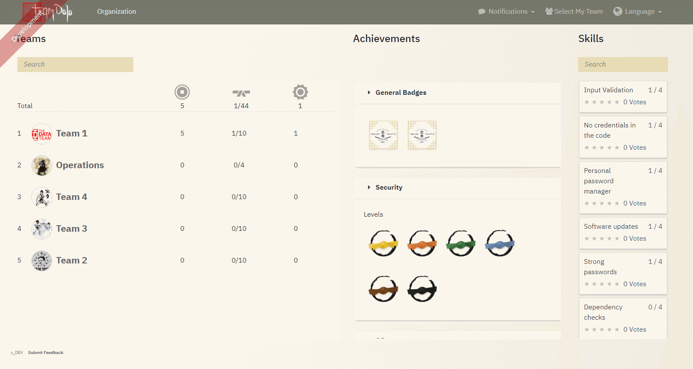

# TeamDojo

An application for improving (application and project) skills of your teams through gamification.

It allows teams to self assess their skills and checks if they are reaching a specified ability level.
If they reach a new ability level, they will be rewarded with a cool new Team Avatar, Level Rewards - 
like a virtual belt -  and topic specific Badges.
TeamDojo also calculates scores, based on specific skill, level and badge ranking/difficulty and ranks the teams by
the amount of their reached scores.  

## Usage

### Cloning
    
    git clone https://github.com/otto-de/TeamDojo.git
    cd TeamDojo/

### Docker
First build a docker image by running:

    ./gradlew bootWar -Pprod buildDocker

Then run:

    docker-compose -f src/main/docker/app.yml up -d
   
The application will be available at [http://localhost:8080](http://localhost:8080)
    

### Model

#### Organization

TeamDojo comes prefilled with some demo data.
Log in with the default admin credentials: _admin/teamdojo_ at [http://localhost:8080/#/admin](http://localhost:8080/#/admin)
and change your __organization__ _Entities - Organization_. It will be your navigation root node.

#### Dimension

Next you would like to create some __Dimensions__ your teams want to reach skills for: _Entities - Dimension_.
Examples could be _Quality Assurance_, _Security_, _Operations_, _Architecture_, ...

#### Team

Teams are the users of TeamDojo. Here you can create them.

_Entities - Team_

- __Name__ - The full Team name.
- __Short Name__ - An acronym of the Team's name. It will be part of the REST URL.
- __Picture__ - The Team's logo
- Team __Slogan__
- Team __Contact Person__
- __Participations__ - Every Team can participate on one or more Dimensions.

#### Level

Now you can specify maturity or ability __Levels__ for these Dimensions.
Each Level should contain _n_ Skills - see next step.

A Level consists of the following settings:

_Entities - Level_
- Name - The level name. Judo belt ranks for example: yellow, orange, green, ...
- [OPTIONAL] __Description__ of the level.
- A __Picture__ to be shown. You can find some examples in [examples/images/level](examples/images/level). 
You can create your own icons, but for the best user experience get some help from some skilled UI/UX people.
- __Required Score__ - A decimal value from 0 to 1. You can define how much percent of reached skills are necessary to get this level.
Default can be 1.0
- __Skill Score Multiplier__ - A decimal value. Here you can specify how much bonus points the team can reach with every skill 
of this level. Default can be 0.0. See [Scoring System](#scoring-system-and-balancing) for more details.
- [OPTIONAL] __Level Completion Bonus__ - A numeric value. How much bonus points the team can reach with the 
completion of this level. See [Scoring System](#scoring-system-and-balancing) for more details.
- __Dimension__ - Every Level must be assigned to one dimension.
- [OPTIONAL] A level can __depends on__ a previous level. E.g.: To reach Level 2, all skills of Level 2 and Level 1 must be completed.

#### Badge

While Level are the core of the maturity model, __Badges__ can be used to push some specific skills or to reward well performing teams.

_Entities - Badges_
- Name - The badge name. Technology specific or cool names for skill subsets. E.g.: AWS Badge, Docker Master, Always-up-to-date Badge, Password Ninja, ...
- [OPTIONAL] __Description__ of the badge.
- A __Picture__ to be shown. You can find some examples in [examples/images/badge](examples/images/badge). 
You can create your own icons, but for the best user experience get some help from some skilled UI/UX people.
- [NOT IMPLEMENTED] Available Until - not implemented yet.
- [NOT IMPLEMENTED] Available Amount - not implemented yet.
- __Required Score__ - A decimal value from 0 to 1. You can define how much percent of reached skills are necessary to get this badge.
Default can be 1.0.
- __Skill Score Multiplier__ - A decimal value. Here you can specify how much bonus points the team can reach with every skill 
of this badge. Default can be 0.0. See [Scoring System](#scoring-system-and-balancing) for more details.
- [OPTIONAL] __Badge Completion Bonus__ - A numeric value. How much bonus points the team can reach with the 
completion of this badge. See [Scoring System](#scoring-system-and-balancing) for more details.
- __Dimensions__ - Every Badge can be assigned to one ore more Dimensions.

#### Skill

The core element of this framework. Teams can obtain __skills__.

_Entities - Skill_
- __Skill Title__ - Short and significant.
- __Description__ - Is part of the skill details. Why is this skill useful? Why should a team aim to obtain this skill?
- __Implementation__ - How can the team reach this skill? Hard facts to configure/implement/learn something.
- __Validation__ - How can the team tell they have achieved this skill? Hard criteria.
- [OPTIONAL] __Expiry Priod__ - For future development. A skill expires after a period of time.
- [OPTIONAL] __Contact__ - A person with know how relevant for this skill.
- __Score__ - With every achieved skill, a team gains scores. A default value could be 1 for every skill.
- [DO NOT TOUCH] __Rate Score__ - Users can vote for a skill (1-5 stars). This value should not be set in the admin view.             
- [DO NOT TOUCH] __Rate Count__ - Users can vote for a skill (1-5 stars). This value should not be set in the admin view.

#### Assign Skills to Level and Badges

Every Skill should be assigned to at least one Level or Badge:
- _Entities - Level Skills_
- _Entities - Badge Skills_

Here you can specify which skills are necessary to reach a specific Level or Badge.

### Scoring System and Balancing

If a team completes a skill, its score will be added to the team's score.
With the Skill __Score__ property you can value its costs / complexity / importance.

To honor the skill completion of specific levels or badges, you can adjust the __Level/Badge Score Multiplier__.
Every completed Skill will add its skill score multiplied with the Score Multiplier.
E.g.:
    
    Skill: TLS everywhere; Score: 10
    Badge: Encryption Master; Score Multiplier: 2
    
    #Completion of TLS everywhere will resulting in:
       10 (Skill Score) 
    +  20 (Skill Score x Score Multiplier)
    => 30 Points   
     
You can also reward the completion of levels and badges. Therefore you can gain bonus points with __Level/Badge Completion Bonus__.
If the required percentage (__Required Score__) of skills for the Badge or Level is reached, the Completion Bonus will be added to the Team scores. E.g.:

    Skill: TLS everywhere; Score: 10
    Skill: Update your Systems; Score: 30
    Level: Green; Required Score: 1.0; Level Completion Bonus: 100
    
    #Completion of all skills will resulting in:
        10 (Skill Score) 
    +   30 (Skill Score) 
    +  100 (Completion Bonus)
    => 140 Points

 You can combine them of course:
 
    Skill: TLS everywhere; Score: 10
    Skill: Update your Systems; Score: 30
    Level: Green; Required Score: 1.0; Score Multiplier: 1; Level Completion Bonus: 100
    Badge: Encryption Master; Score Multiplier: 2 
    
    
    #Completion of all skills will resulting in:
        10 (Skill Score) 
    +   10 (Skill Score x Level Multiplier)
    +   20 (Skill Score x Badge Multiplier) 
    +   30 (Skill Score) 
    +   30 (Skill Score x Level Multiplier) 
    +  100 (Level Completion Bonus)
    => 200 Points 

## Security

For maximum transparency and accessibility there is no user / role concept.
Everyone can see and change everything. An exception is the technical Administrator.
He configures rarely changing data like teams, levels, skills, etc. to hide the internal complexity.

We believe that this tool helps software development teams to track where they are performing well and where they can
become improve to build better software.
Any additional complexity level - processes, login, role models - will result in a decreasing motivation to use 
yet another tool during your daily business.

The easiest way to hide your internal data are IP whitelists on network level. 
Host this tool in your internal network and let everyone use and see it.

If you really want any kind of authentication/authorization process, build it, push it back into this repository but make it optional.

### Default secrets / credentials

The default admin credentials are: __admin/teamdojo__, configured in [src/main/resources/config/liquibase/users.csv](src/main/resources/config/liquibase/users.csv).

The secret for the "Remember me" Cookie is configured in [src/main/resources/config/application-prod.yml](src/main/resources/config/application-prod.yml).

Please change the password and secret in your production environment.

## Development

[Here](DEVELOPMENT.md) you can find the dev documentation. 
